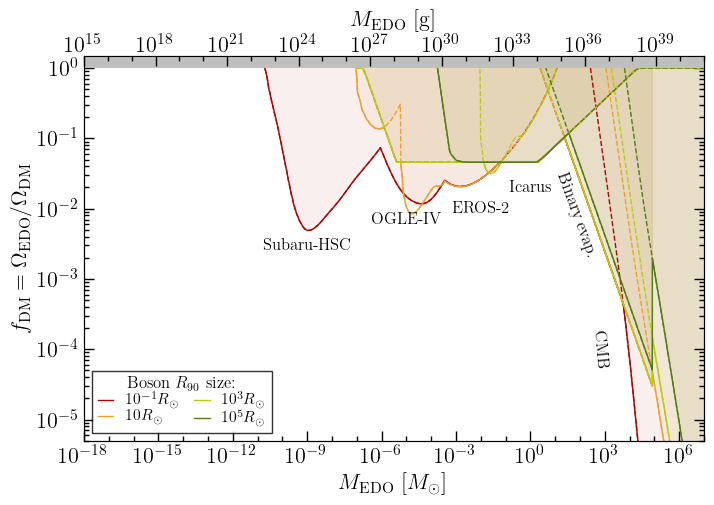

## EDObounds

 [](https://arxiv.org/abs/2407.02573) [](https://opensource.org/licenses/MIT)

*A collection of bounds on extended dark matter objects (EDOs) and code for plotting them.*

 


### Bounds

The list of all available, tabulated bounds can be found in the [bounds/](bounds/) folder, with a dedicated sub-folder for each shape: NFW subhalos, boson stars, uniform spheres and ultra-compact minihalos (see the [paper](https://arxiv.org/abs/2407.02573) for a description of their density functions). You can use the listfile function "All" to produce the minimum of all bounds.

In Section 3 of the [paper](https://arxiv.org/abs/2407.02573) we explain in detail how to use the code.

### Contributing

If you'd like to contribute to the repository with new bounds, you can either:
1. Make the changes yourself:
	* Add the new bound as a folder in the [bounds/](bounds/) folder, containing one sub-folder for each shape (you don't need to have bounds for all) and one ".txt" file with the bibitem of your paper and a small comment linking the source of the bounds. Inside each sub-folder, include one ".txt" file for each provided radius, named "rN.txt", where N is given by $R_{90}=10^N R_{\odot}$ (for negative exponentials, write a hyphen, e.g., $r-1.txt" for $R_{90}=10^{-1}R_{\odot}$). Each file should have two columns, corresponding to the EDO mass in Solar masses, and the constraint on the EDO fraction. A more in-depth explanation of this can be found in Section 3.2 of this [paper](https://arxiv.org/abs/2407.02573).
	* Update the [bounds/README.md](https://github.com/SergioSevi/EDObounds/blob/master/bounds/README.md) file with information about the new bound.
	* Submit a pull request
2. Create an issue on the GitHub repository with a link to the paper/bound you believe is missing.  
3. Contact us directly at sergio.sevillano-munoz@durham.ac.uk or djuna.l.croon@durham.ac.uk and let us know which bound you think should be added.

### Plots

Some example plots for different EDO radius and shapes can be found in the [plots/](plots/) folder.

You can produce new plots with
```
python PlotEDObounds.py --listfile LIST_FILE --outfile OUT_FILE --massdistribution MASS_DISTRIBUTION
```
where `LIST_FILE` is a text file containing a list of bounds to be plotted (see `listfiles/list_all.txt` for an example),  `OUT_FILE` is the full filename of the image to be output (e.g. `plots/PBHbounds.pdf`), and `MASS_DISTRIBUTION` allows to plot non-monochromatic set of bounds, following the work in [here](https://arxiv.org/abs/1705.05567). You can use the short flags `-lf`, `-of` and `-md` for specifying the list file and output file. (**Note that you will need the [tools.py/](tools.py/) file in the same folder as PlotEDObounds.py.**)

**Supported mass distributions:** Included mass distributions are `monochromatic` (by default), `lognormal(sigma,M,Mc)` and `skew_lognormal(sigma,alpha,M,Mc)`

This code is an extension of Bradley Kavanagh's [pbhbounds](https://github.com/bradkav/PBHbounds) repository. Among the new additions, this code automatically generates the list of citations for all bounds appearing in the created plot in a file called "Cite.txt".
### Versions

**Version 1.0 (25/06/2024):** Release version. Created for the [paper](https://arxiv.org/abs/2407.02573).
**Version 1.1 (25/06/2024): Added different mass distributions.
### Citation

Feel free to use the bounds and code, but please make sure to cite all of the individual plotted bounds (the bibitems for this are automatically generated in the "Cite.txt" file) and this repository through the [paper](https://arxiv.org/abs/2407.02573) (see [here](https://ui.adsabs.harvard.edu/abs/2024arXiv240702573C/exportcitation) for different citation formats).

